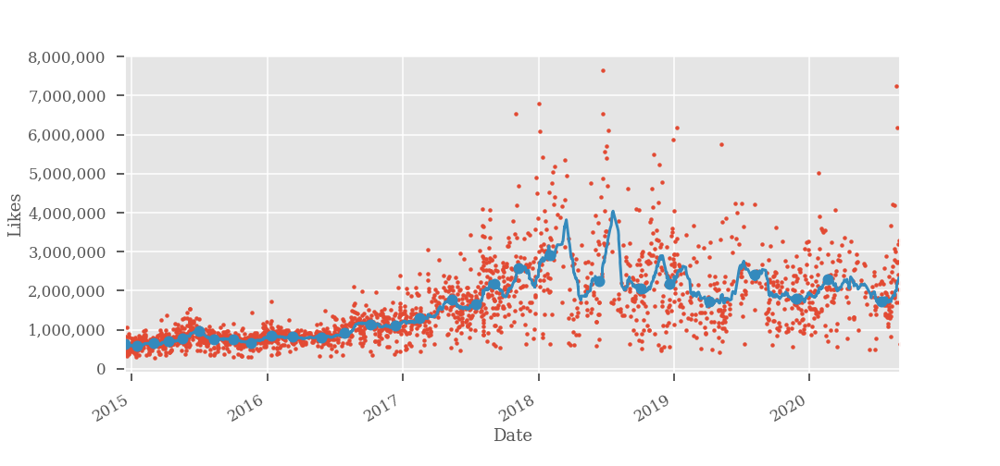
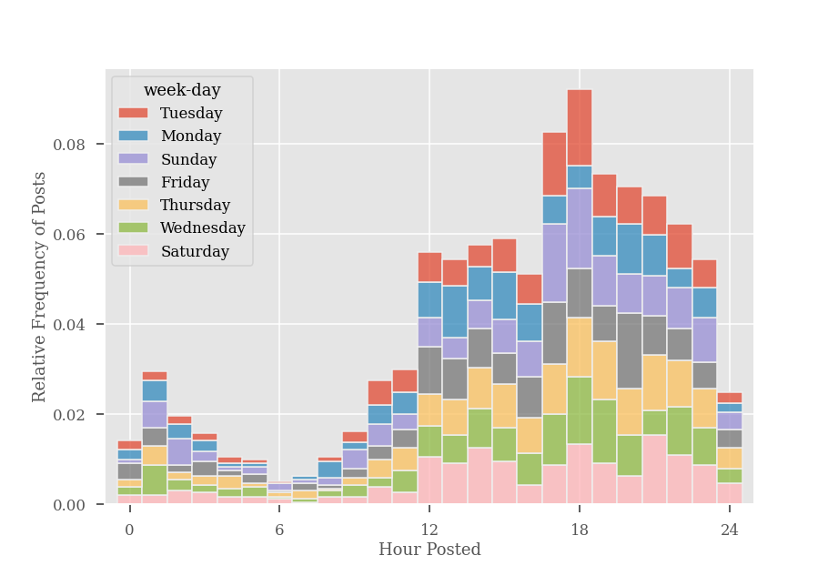
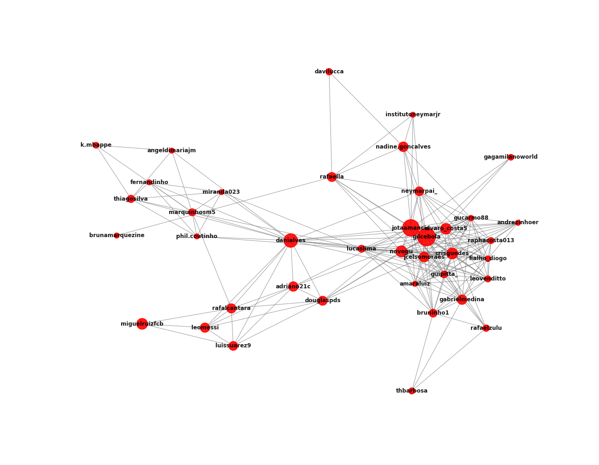

# IG-DataAnalysis

### About
* IG-DataAnalysis is an web scrapping tool combined with data analysis. It extracts useful information of public Instagram profiles, using Selenium, to analyse patterns and trends.

### How to install the dependencies
#### Globally
* Make sure that you have python3 installed in your computer
* Open the application folder and install the required packages in requirements.txt with the following command `pip3 install -r requirements.txt`

### How it is structured
* The folder `src/d00_scrapper` possess the web scrapping functionalities and a `main.py` function with a recommendation of how the json containing the raw mined data could be saved. An example of a raw mined data
is available at `data/neymarjr-raw.json`.
* The folder `src/d01_clean` is dedicated to process the raw data into a proper format for the data analysis.
A `main.py` function is available with a recommendation of how the json containing the processed data could be saved. An example of a processed data is available at `data/neymarjr-clean.json`.
* The data analysis is performed by the notebook presented at `notebooks/IGAnalyser.ipynb`.

### Screenshots
* Data mined from `neymarjr` public Instagram page.

#### Likes through time

    

 

#### Histogram of time of post

    

 

#### Proportion representation of type of post

    

 

#### Network connection of people that were tagged in the same photo in `neymarjr` posts

    

 
